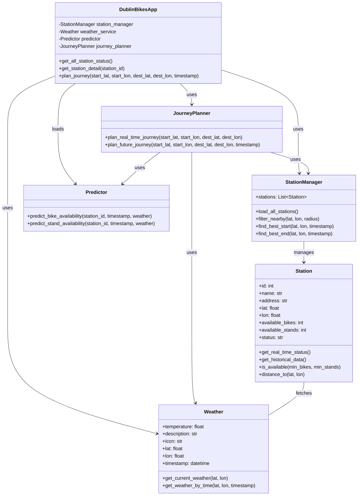

```mermaid
classDiagram
    direction TB
    class Station {
    +id: int
    +name: str
    +address: str
    +lat: float
    +lon: float
    +available_bikes: int
    +available_stands: int
    +status: str
    +get_real_time_status()
    +get_historical_data()
    +is_available(min_bikes, min_stands)
    +distance_to(lat, lon)
}

    class Weather {
        +temperature: float
        +description: str
        +icon: str
        +lat: float
        +lon: float
        +timestamp: datetime
        +get_current_weather(lat, lon)
        +get_weather_by_time(lat, lon, timestamp)
    }

    class StationManager {
        +stations: List~Station~
        +load_all_stations()
        +filter_nearby(lat, lon, radius)
        +find_best_start(lat, lon, timestamp)
        +find_best_end(lat, lon, timestamp)
    }

    class JourneyPlanner {
        +plan_real_time_journey(start_lat, start_lon, dest_lat, dest_lon)
        +plan_future_journey(start_lat, start_lon, dest_lat, dest_lon, timestamp)
    }

    class Predictor {
        +predict_bike_availability(station_id, timestamp, weather)
        +predict_stand_availability(station_id, timestamp, weather)
    }

    class DublinBikesApp {
        -StationManager station_manager
        -Weather weather_service
        -Predictor predictor
        -JourneyPlanner journey_planner
        +get_all_station_status()
        +get_station_detail(station_id)
        +plan_journey(start_lat, start_lon, dest_lat, dest_lon, timestamp)
    }

    DublinBikesApp --> StationManager : uses
    DublinBikesApp --> Weather : uses
    DublinBikesApp --> Predictor : loads
    DublinBikesApp --> JourneyPlanner : uses
    StationManager --> Station : manages
    JourneyPlanner --> StationManager : uses
    JourneyPlanner --> Predictor : uses
    JourneyPlanner --> Weather : uses
    Station -- Weather : fetches

    classDef Pine :, stroke-width:1px, stroke-dasharray:none, stroke:#254336, fill:#27654A, color:#FFFFFF
    classDef Aqua :, stroke-width:1px, stroke-dasharray:none, stroke:#46EDC8, fill:#DEFFF8, color:#378E7A
    classDef Sky :, stroke-width:1px, stroke-dasharray:none, stroke:#374D7C, fill:#E2EBFF, color:#374D7C
    classDef Ash :, stroke-width:1px, stroke-dasharray:none, stroke:#999999, fill:#EEEEEE, color:#000000
    classDef Peach :, stroke-width:1px, stroke-dasharray:none, stroke:#FBB35A, fill:#FFEFDB, color:#8F632D
```