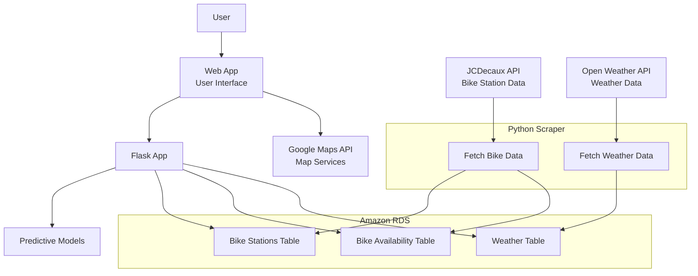

```mermaid
graph TD
  %% User and Frontend
  User[User] --> WebApp[Web App<br>User Interface]

  %% External APIs
  JCDecaux[JCDecaux API<br>Bike Station Data]
  WeatherAPI[Open Weather API<br>Weather Data]
  GoogleMaps[Google Maps API<br>Map Services]

  %% Backend (Flask and Prediction)
  WebApp --> Flask[Flask App]
  Flask --> PredictiveModels[Predictive Models]

  %% Database
  subgraph Amazon RDS
    StationTable[Bike Stations Table]
    AvailabilityTable[Bike Availability Table]
    WeatherTable[Weather Table]
  end

  %% Python Scraper
  subgraph Python Scraper
    BikeScraper[Fetch Bike Data]
    WeatherScraper[Fetch Weather Data]
  end

  %% Data Flow
  JCDecaux --> BikeScraper
  WeatherAPI --> WeatherScraper

  BikeScraper --> StationTable
  BikeScraper --> AvailabilityTable
  WeatherScraper --> WeatherTable

  Flask --> StationTable
  Flask --> AvailabilityTable
  Flask --> WeatherTable

  WebApp --> GoogleMaps
```