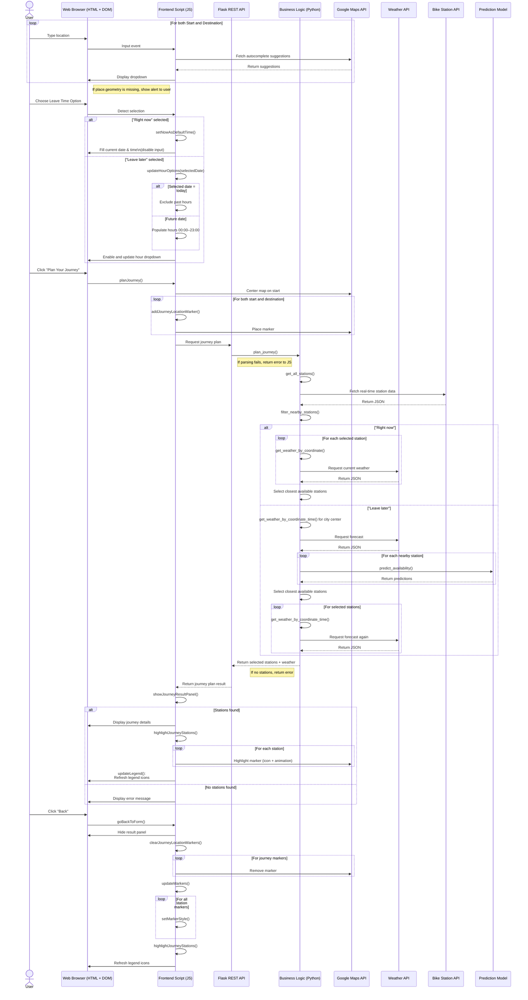

```mermaid
sequenceDiagram
  actor User as User
  participant Browser as Web Browser (HTML + DOM)
  participant JS as Frontend Script (JS)
  participant Flask as Flask REST API
  participant Logic as Business Logic (Python)
  participant GoogleMaps as Google Maps API
  participant WeatherAPI as Weather API
  participant BikeAPI as Bike Station API
  participant MLModel as Prediction Model

  loop For both Start and Destination
    User ->> Browser: Type location
    Browser ->> JS: Input event
    JS ->> GoogleMaps: Fetch autocomplete suggestions
    GoogleMaps -->> JS: Return suggestions
    JS ->> Browser: Display dropdown
  end
  note left of JS: If place.geometry is missing, show alert to user

  User ->> Browser: Choose Leave Time Option
  Browser ->> JS: Detect selection
  alt "Right now" selected
    JS ->> JS: setNowAsDefaultTime()
    JS ->> Browser: Fill current date & time\n(disable input)
  else "Leave later" selected
    JS ->> JS: updateHourOptions(selectedDate)
    alt Selected date = today
      JS ->> JS: Exclude past hours
    else Future date
      JS ->> JS: Populate hours 00:00–23:00
    end
    JS ->> Browser: Enable and update hour dropdown
  end

  User ->> Browser: Click "Plan Your Journey"
  Browser ->> JS: planJourney()
  JS ->> GoogleMaps: Center map on start
  loop For both start and destination
    JS ->> JS: addJourneyLocationMarker()
    JS ->> GoogleMaps: Place marker
  end

  JS ->> Flask: Request journey plan
  Flask ->> Logic: plan_journey()
  note right of Flask: If parsing fails, return error to JS

  Logic ->> Logic: get_all_stations()
  Logic ->> BikeAPI: Fetch real-time station data
  BikeAPI -->> Logic: Return JSON
  Logic ->> Logic: filter_nearby_stations()

  alt "Right now"
    loop For each selected station
      Logic ->> Logic: get_weather_by_coordinate()
      Logic ->> WeatherAPI: Request current weather
      WeatherAPI -->> Logic: Return JSON
    end
    Logic ->> Logic: Select closest available stations
  else "Leave later"
    Logic ->> Logic: get_weather_by_coordinate_time() for city center
    Logic ->> WeatherAPI: Request forecast
    WeatherAPI -->> Logic: Return JSON

    loop For each nearby station
      Logic ->> MLModel: predict_availability()
      MLModel -->> Logic: Return predictions
    end
    Logic ->> Logic: Select closest available stations

    loop For selected stations
      Logic ->> Logic: get_weather_by_coordinate_time()
      Logic ->> WeatherAPI: Request forecast again
      WeatherAPI -->> Logic: Return JSON
    end
  end

  Logic -->> Flask: Return selected stations + weather
  note left of Logic: If no stations, return error
  Flask -->> JS: Return journey plan result

  JS ->> JS: showJourneyResultPanel()
  alt Stations found
    JS ->> Browser: Display journey details
    JS ->> JS: highlightJourneyStations()
    loop For each station
      JS ->> GoogleMaps: Highlight marker (icon + animation)
    end
    JS ->> Browser: updateLegend(): <br> Refresh legend icons
  else No stations found
    JS ->> Browser: Display error message
  end

  User ->> Browser: Click "Back"
  Browser ->> JS: goBackToForm()
  JS ->> Browser: Hide result panel
  JS ->> JS: clearJourneyLocationMarkers()
  loop For journey markers
    JS ->> GoogleMaps: Remove marker
  end
  JS ->> JS: updateMarkers()
  loop For all station markers
    JS ->> JS: setMarkerStyle()
  end

  JS ->> JS: highlightJourneyStations()
  JS ->> Browser: Refresh legend icons
  

```
