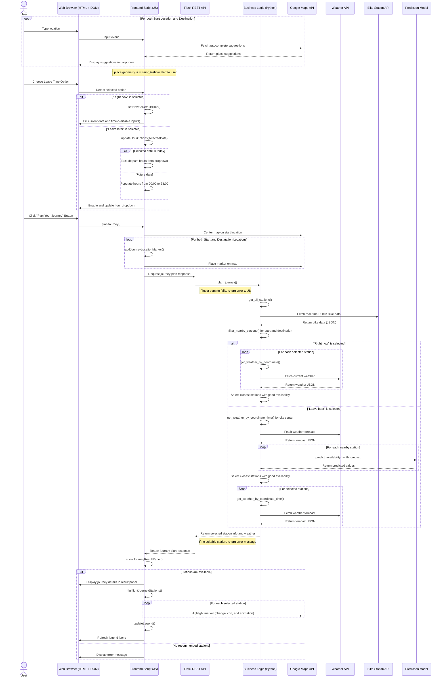

```mermaid
sequenceDiagram
  actor User as User
  participant Browser as Web Browser (HTML + DOM)
  participant JS as Frontend Script (JS)
  participant Flask as Flask REST API
  participant Logic as Business Logic (Python)
  participant GoogleMaps as Google Maps API
  participant WeatherAPI as Weather API
  participant BikeAPI as Bike Station API
  participant MLModel as Prediction Model

  loop For both Start Location and Destination
    User ->> Browser: Type location
    Browser ->> JS: Input event
    JS ->> GoogleMaps: Fetch autocomplete suggestions
    GoogleMaps -->> JS: Return place suggestions
    JS ->> Browser: Display suggestions in dropdown
  end
  note over JS: If place.geometry is missing,\nshow alert to user

  User ->> Browser: Choose Leave Time Option
  Browser ->> JS: Detect selected option
  alt "Right now" is selected
    JS ->> JS: setNowAsDefaultTime()
    JS ->> Browser: Fill current date and time\n(disable inputs)
  else "Leave later" is selected
    JS ->> JS: updateHourOptions(selectedDate)
    alt Selected date is today
      JS ->> JS: Exclude past hours from dropdown
    else Future date
      JS ->> JS: Populate hours from 00:00 to 23:00
    end
    JS ->> Browser: Enable and update hour dropdown
  end

  User ->> Browser: Click "Plan Your Journey" Button
  Browser ->> JS: planJourney()
  JS ->> GoogleMaps: Center map on start location
  loop For both Start and Destination Locations
    JS ->> JS: addJourneyLocationMarker()
    JS ->> GoogleMaps: Place marker on map
  end

  JS ->> Flask: Request journey plan response
  Flask ->> Logic: plan_journey()
  note right of Flask: If input parsing fails, return error to JS

  Logic ->> Logic: get_all_stations()
  Logic ->> BikeAPI: Fetch real-time Dublin Bike data
  BikeAPI -->> Logic: Return bike data (JSON)
  Logic ->> Logic: filter_nearby_stations() for start and destination

  alt "Right now" is selected
    loop For each selected station
      Logic ->> Logic: get_weather_by_coordinate()
      Logic ->> WeatherAPI: Fetch current weather
      WeatherAPI -->> Logic: Return weather JSON
    end
    Logic ->> Logic: Select closest stations with good availability
  else "Leave later" is selected
    Logic ->> Logic: get_weather_by_coordinate_time() for city center
    Logic ->> WeatherAPI: Fetch weather forecast
    WeatherAPI -->> Logic: Return forecast JSON

    loop For each nearby station
      Logic ->> MLModel: predict_availability() with forecast
      MLModel -->> Logic: Return predicted values
    end
    Logic ->> Logic: Select closest stations with good availability

    loop For selected stations
      Logic ->> Logic: get_weather_by_coordinate_time()
      Logic ->> WeatherAPI: Fetch weather forecast
      WeatherAPI -->> Logic: Return forecast JSON
    end
  end

  Logic -->> Flask: Return selected station info and weather
  note left of Logic: If no suitable station, return error message
  Flask -->> JS: Return journey plan response

  JS ->> JS: showJourneyResultPanel()
  alt Stations are available
    JS ->> Browser: Display journey details in result panel
    JS ->> JS: highlightJourneyStations()
    loop For each selected station
        JS ->> GoogleMaps: Highlight marker (change icon, add animation)
    end
    JS ->> JS: updateLegend()
    JS ->> Browser: Refresh legend icons
  else No recommended stations
    JS ->> Browser: Display error message
  end
```
