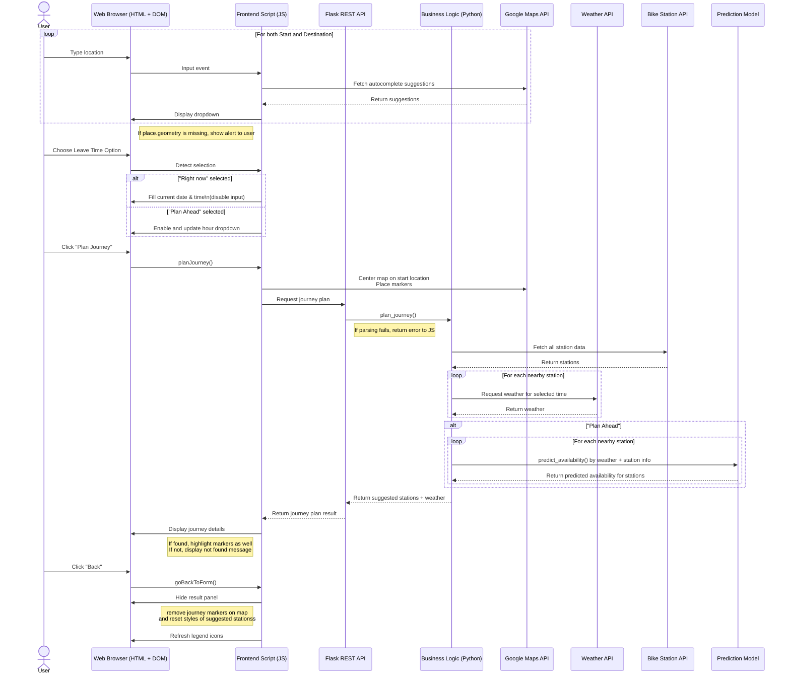

```mermaid
sequenceDiagram
  actor User as User
  participant Browser as Web Browser (HTML + DOM)
  participant JS as Frontend Script (JS)
  participant Flask as Flask REST API
  participant Logic as Business Logic (Python)
  participant GoogleMaps as Google Maps API
  participant WeatherAPI as Weather API
  participant BikeAPI as Bike Station API
  participant MLModel as Prediction Model

  loop For both Start and Destination
    User ->> Browser: Type location
    Browser ->> JS: Input event
    JS ->> GoogleMaps: Fetch autocomplete suggestions
    GoogleMaps -->> JS: Return suggestions
    JS ->> Browser: Display dropdown
  end
  note left of JS: If place.geometry is missing, show alert to user

  User ->> Browser: Choose Leave Time Option
  Browser ->> JS: Detect selection
  alt "Right now" selected
    JS ->> Browser: Fill current date & time\n(disable input)
  else "Plan Ahead" selected
    JS ->> Browser: Enable and update hour dropdown
  end

  User ->> Browser: Click "Plan Journey"
  Browser ->> JS: planJourney()
  JS ->> GoogleMaps: Center map on start location <br> Place markers 
  JS ->> Flask: Request journey plan
  Flask ->> Logic: plan_journey()
  note right of Flask: If parsing fails, return error to JS

  Logic ->> BikeAPI: Fetch all station data
  BikeAPI -->> Logic: Return stations

  loop For each nearby station
      Logic ->> WeatherAPI: Request weather for selected time
      WeatherAPI -->> Logic: Return weather
    end

  alt "Plan Ahead"
    loop For each nearby station
      Logic ->> MLModel: predict_availability() by weather + station info
      MLModel -->> Logic: Return predicted availability for stations
    end
  end

  Logic -->> Flask: Return suggested stations + weather
  Flask -->> JS: Return journey plan result

  JS ->> Browser: Display journey details
  Note left of JS: If found, highlight markers as well <br> If not, display not found message

  User ->> Browser: Click "Back"
  Browser ->> JS: goBackToForm()
  JS ->> Browser: Hide result panel
  Note left of JS: remove journey markers on map <br> and reset styles of suggested stationss
  JS ->> Browser: Refresh legend icons
```
